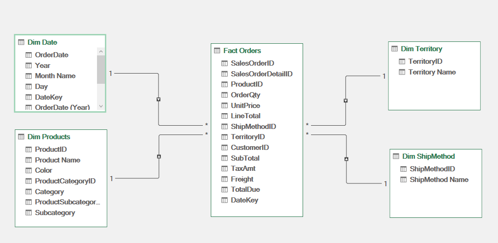
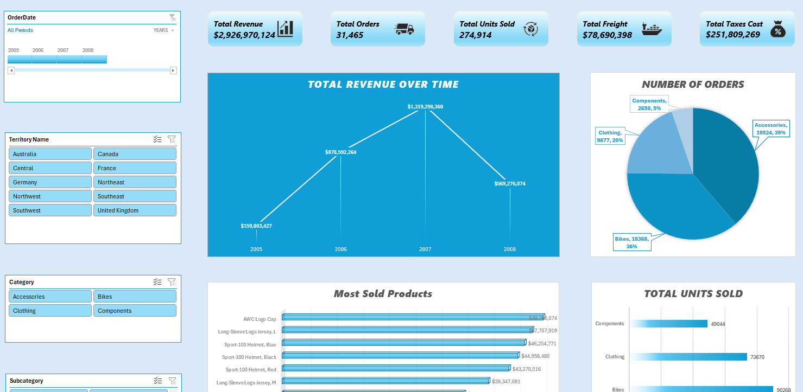
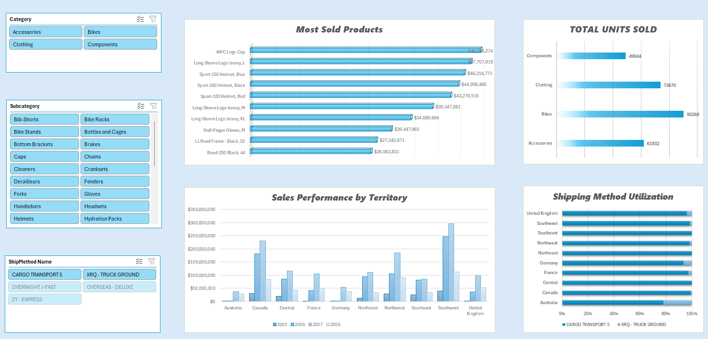

# AdventureWorks Retail Sales Analysis and Dashboard

## Project Overview
This project presents an end-to-end data analysis and visualization solution based on the AdventureWorks retail dataset. The primary objective was to extract raw sales data, perform extensive data transformation and cleaning, establish a robust relational data model, and design an interactive dashboard to uncover key business insights and track performance metrics.

## Technical Stack
* **Data Cleaning and Transformation:** Power Query / MS Excel
* **Data Modeling:** Power Pivot
* **Data Visualization:** MS Excel Pivot Tables and Pivot Charts

## Data Architecture
To ensure optimal query performance and accurate cross-filtering, the dataset was modeled using a **Star Schema** architecture.

* **Fact Table:** 
  * `Fact Orders`: Records granular transaction details (OrderQty, UnitPrice, LineTotal, TaxAmt, Freight).
* **Dimension Tables:** 
  * `Dim Date`: OrderDate, Year, Month, Day.
  * `Dim Products`: Product Name, Category, Subcategory.
  * `Dim Territory`: Territory Name, Country.
  * `Dim ShipMethod`: Shipping Method Name.

## Key Performance Indicators (KPIs)
The dashboard tracks the following high-level metrics across the 2005-2008 fiscal periods:
* **Total Revenue:** $2,926,970,124
* **Total Orders:** 31,465
* **Total Units Sold:** 274,914
* **Total Freight:** $78,690,398
* **Total Taxes Cost:** $251,809,269

## Dashboard and Visualizations
The interactive dashboard features dynamic filtering via a dedicated slicer panel (Order Date, Territory, Category, Subcategory, and Ship Method), allowing for granular drill-downs into specific business segments. The layout was designed with UI/UX principles in mind to ensure clarity and ease of navigation.

**Key Insights Visualized:**
* **Total Revenue Over Time:** Line chart tracking financial growth and seasonal trends.
* **Order Distribution:** Pie chart breaking down orders by product category (Bikes, Accessories, Clothing, Components).
* **Most Sold Products:** Bar chart highlighting top-performing individual items.
* **Sales Performance by Territory:** Clustered column chart comparing yearly sales across global territories.
* **Shipping Method Utilization:** 100% stacked bar chart analyzing preferred logistics.

## Repository Structure
* `/Dashboard`: Contains the final `.xlsx` file with the embedded data model and interactive dashboard.
* `/Images`: Contains screenshots of the dashboard interface and relational data model.
* `/Demo`: Contains a video demonstration of the dashboard functionality and slicer interactions.

## How to Run
1. Clone this repository to your local environment.
2. Navigate to the `/Dashboard` directory and open the Excel file.
3. Ensure data connections are enabled if prompted by Excel.
4. Utilize the slicer panel on the left side of the dashboard to interact with the visualizations.
